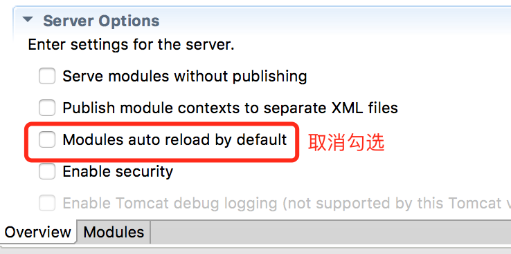

# 部署

# tomcat
<a href="#tomcat"></a>

### 1. 关闭 eclipse server `Auto Reload` 特性

  * 禁用默认值


  * 单独禁用项


* 建议关闭 jar 扫描, 提高启动速度, 减少内存占用 , 修改 `catalina.properties `

```properties
tomcat.util.scan.StandardJarScanFilter.jarsToSkip=*.jar
```

### 2. 内存设置

 * Linux  修改 `catalina.sh` ,开始处添加

    ```bash
        JAVA_OPTS='-Xms512m -Xmx2048m'
    ```
 * Windows 修改 `catalina.bat`

    ```bash
        set JAVA_OPTS=-Xms512m -Xmx2048m
    ```

### 3. 启用远程 JMX 连接

 修改 catalina.sh , 搜索 `[ "$1" = "start" ]` , 在下方添加

```bash
JAVA_OPTS="-Dcom.sun.management.jmxremote \
-Dcom.sun.management.jmxremote.port=1099 \
-Djava.rmi.server.hostname=192.168.1.111 \
-Dcom.sun.management.jmxremote.ssl=false \
-Dcom.sun.management.jmxremote.authenticate=false $JAVA_OPTS"
```

> linux 系统可以用 `` `hostname -i` `` 获取 ip

# Weblogic
<a href="#weblogic"></a>
>感谢融资租赁事业部的技术小伙伴协助!

weblogic 上的部署有些特殊，主要注意以下几点：
> **以下设置仅仅针对 weblogic 12 版本，其他版本可能存在通配符等问题**

### 1. JNDI 数据源
weblogic 上定义好数据源后，在 `config.properties` 中需要修改 jndi 的名字
```properties
db.jndiName=hap_dev
```
> tomcat 中是 java:comp/env/jdbc/hap_dev，这点不一样

### 2. jar 冲突问题
weblogic 上的一些 jar 和框架中的存在冲突，需要排除掉。

修改项目中的 `pom.xml`，留意注释下的配置
```xml
<dependency>
    <groupId>com.hand</groupId>
    <artifactId>hap</artifactId>
    <type>war</type>
    <version>${hap.version}</version>
    <!--排除 jar -->
    <exclusions>
        <exclusion>
            <groupId>com.google.guava</groupId>
            <artifactId>guava</artifactId>
        </exclusion>
    </exclusions>    
</dependency>
<dependency>
    <groupId>com.hand</groupId>
    <artifactId>hap</artifactId>
    <version>${hap.version}</version>
    <classifier>classes</classifier>
    <scope>provided</scope>
    <!--排除 jar -->
    <exclusions>
        <exclusion>
            <groupId>com.google.guava</groupId>
            <artifactId>guava</artifactId>
        </exclusion>
    </exclusions>
</dependency>
<dependency>
    <groupId>com.hand</groupId>
    <artifactId>hap-db</artifactId>
    <version>${hap.version}</version>
    <!--排除 jar -->
    <exclusions>
        <exclusion>
            <groupId>com.google.guava</groupId>
            <artifactId>guava</artifactId>
        </exclusion>
    </exclusions>
</dependency>
...
<plugin>
    <groupId>org.apache.maven.plugins</groupId>
    <artifactId>maven-war-plugin</artifactId>
    <version>2.6</version>
    <configuration>
        <attachClasses>true</attachClasses>
        <overlays>
            <overlay>
                <groupId>com.hand</groupId>
                <artifactId>hap</artifactId>
                <!--排除 jar -->
                <excludes>
                    <exclude>WEB-INF/lib/guava-15.0.jar</exclude>
                    <exclude>WEB-INF/lib/stax-api-1.0.1.jar</exclude>
                    <exclude>WEB-INF/lib/xercesImpl-2.10.0.jar</exclude>
                    <exclude>WEB-INF/lib/xml-apis-1.3.04.jar</exclude>
                    <exclude>WEB-INF/lib/xml-apis-ext-1.3.04.jar</exclude>
                </excludes>
            </overlay>
        </overlays>
    </configuration>
</plugin>
```

打包后确保 lib 目录不存在上述 6 个 jar。

### 3. 新增 weblogic.xml
在 WEB-INF 目录下新增 weblogic.xml
```xml
<?xml version="1.0" encoding="UTF-8"?>
<weblogic-web-app>
	<container-descriptor>
		<prefer-application-packages>
			<package-name>org.springframework.*</package-name>
			<package-name>org.hibernate.*</package-name>
			<package-name>javax.validation.*</package-name>
			<package-name>javax.validation.spi.*</package-name>
			<package-name>org.slf4j.*</package-name>
		</prefer-application-packages>
		<show-archived-real-path-enabled>true</show-archived-real-path-enabled>
	</container-descriptor>
</weblogic-web-app>
```

上述 3 点在部署的时候请留意。
