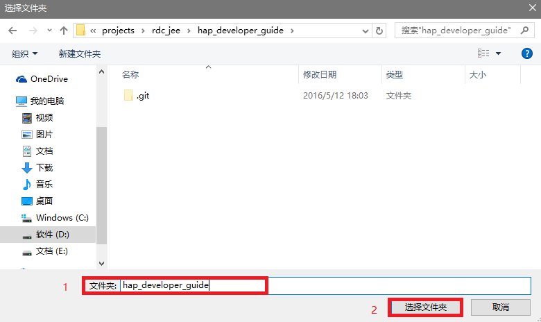

# GitBook使用

## 软件下载

前往 [ GitBook 官网 ](https://www.gitbook.com/editor/windows)下载 GitBook 安装包。

## 软件安装

执行下载好的 GitBook 安装包即可安装 GitBook。

## 创建书籍

1. 打开安装好的 GitBook。
2. 选择 New Book。  

3. 输入 Book 的名称，选择 Create Book。  

4. 创建成功以后视图中出现刚创建的图书，点击就可以打开刚创建的图书了。  


## 下载书籍

1. 首先从 GitLab 库中 clone 已存在的某书籍。
2. 选择 import 导入该书籍的文件夹。  



## 同步书籍
当书籍内容发生更改后，可以通过点击 Sync 进行同步。  


## GitBook 语法

* GitBook 采用的是 MarkDown 语法， Markdown 的语法全由一些符号所组成。  
* 而 Markdown 是 HTML 的一个子集，所以 Markdown 完全兼容 Html 的语法，也就意味着在文本中的任何位置使用 html 标签都是可以的。  
* 但在 html 标签中使用 Markdown 语法则无法被识别。  
* 所以在文本中不建议使用 html 语法。

### 目录

* [横线](#横线)
* [标题](#标题)
* [文本](#文本)
  * [普通文本](#普通文本)
  * [单行文本](#单行文本)
  * [文本块](#文本块)
  * [文字换行](#文字换行)
  * [斜体、粗体、删除线](#斜体、粗体、删除线)
  * [数学符号](#数学符号)
* [代码](#代码)
  * [短代码](#短代码)
  * [代码块](#代码块)
  * [代码高亮](#代码高亮)
* [链接](#链接)
  * [基本链接](#基本链接)
  * [文字链接](#文字链接)
  * [本地仓库链接](#本地仓库链接)
  * [页内锚点](#页内锚点)
* [图片](#图片)
  * [显示图片](#显示图片)
  * [图片链接](#图片链接)
* [列表](#列表)
  * [无序列表](#无序列表)
    * [多级无序列表](#多级无序列表)
  * [有序列表](#有序列表)
    * [有序列表自动排序](#有序列表自动排序)
    * [多级有序列表](#多级有序列表)
  * [复选框列表](#复选框列表)
* [表格](#表格)
* [表情](#表情)


### 横线

`***、---、___` 可以显示横线效果，效果如下：

***

---

___

### 标题

```
# H1
## H2
### H3
#### H4
##### H5
###### H6
```
对于 H1，H2 也可以使用如下语法：

```
H1
======

H2
------
```

### 文本

#### 普通文本

只是一行普通文本。

#### 单行文本

在一行的开头添加4个空格即可。 

    这是一行单行文本。
    
#### 文本块

在连续几行的文本开头4个空格。

    这是第一行。
    这是第二行。
    这是第三行。
    
#### 文字换行

直接回车并不能换行：  
1. 在上一行文本最后添加两个空格。
2. 两行文本直接加一个空行，这样行距更大。
3. 使用 html 标签中的 `<p>` 标签也可以达到换行效果。

#### 斜体、粗体、删除线

| 语法 | 效果 |
| -------- | -------- |
| `*斜体1*` | *斜体1* |
| `_斜体2_` | _斜体2_ |
| `**粗体1**` | **粗体1** |
| `__粗体2__` | __粗体2__ |
| `这是一个 ~~删除线~~` | 这是一个 ~~删除线~~ |
| `***斜粗体1***` | ***斜粗体1*** |
| `___斜粗体2___` | ___斜粗体2___ |
| `***~~斜粗体删除线1~~***` |***~~斜粗体删除线1~~*** |
| `~~***斜粗体删除线2***~~` | ~~***斜粗体删除线2***~~ |

#### 数学符号

使用四个 ` $ ` 将要写的符号包含起来。  

$$math$$

### 代码

#### 短代码

使用 ` ` ` 将短的代码包起来。

#### 代码块

使用 ` ``` ` 在代码块前后。
```
这是一段代码块。
这是一段代码块。
```

#### 代码高亮

在` ``` `后面加上编程语言的名字，另起一行开始写代码，最后一行再加` ``` `。

```java
public static void main(String[] args){} //Java
```
```c
int main(int argc, char *argv[]) //C
```
```bash
echo "hello GitHub" #Bash
```
```javascript
document.getElementById("myH1").innerHTML="Welcome to my Homepage"; //javascipt
```
```cpp
string &operator+(const string& A,const string& B) //cpp
```
```javascript
var s = "JavaScript syntax highlighting";
alert(s);
```
```python
def function():
    #indenting works just fine in the fenced code block
    s = "Python syntax highlighting"
    print s
```
```ruby
require 'redcarpet'
markdown = Redcarpet.new("Hello World!")
puts markdown.to_html
```

**注:** *编程语言必须为英文小写字母，否则在 GitLab 上可能无法显示效果*

### 链接

#### 基本链接

GitBook 几乎可以自动链接任何URL，只要直接复制链接到文本中即可。
http://www.google.com

#### 文字链接

| 样式 | 语法 | 效果 |
| -------- | -------- | -------- |
| 内嵌式链接 | ` [这是一个内嵌式链接](https://www.google.com "这是一个内嵌式lianjie") ` | [这是一个内嵌式链接](https://www.google.com "这是一个内嵌式lianjie") |
| 引用式链接 | ` [这是一个引用式链接][text] ` | [这是一个引用式链接][text] |
| URL 标识符 | ` [text]: https://www.google.com "这是 URL 标识符"` | [[text]: https://www.google.com "这是 URL 标识符" |

**注:** *一般把全文所有的 URL 标识符统一放在文章末尾*

#### 本地仓库链接

| 语法  | 效果 |
| -------- | --------- |
| ` [这将指向 SUMMARY.md 文件](/SUMMARY.md) ` | [这将指向 SUMMARY.md 文件](/SUMMARY.md) |
|` [这将指向 根目录](./) `|[这将指向根目录](./)  |

#### 页内锚点

| 语法  | 效果 |
| -------- | --------- |
| ` [回到顶部](#软件下载) ` | [回到顶部](#软件下载)  |

### 图片

#### 显示图片

基本格式：
```

```
alt 和 title 即对应 HTML 中的 alt 和 title 属性（都可省略）：

* alt 表示图片显示失败时的替换文本。
* title 表示鼠标悬停在图片时的显示文本（注意这里要加引号）。
* url 即图片的 url 地址，如果引用本仓库中的图片，直接使用相对路径就可了。


#### 图片链接

给图片加链接的本质是混合图片显示语法和普通的链接语法。普通的链接中` [ ] `内部是链接要显示的文本，而图片链接` [ ] `里面则是要显示的图片。

| 语法 | 效果 |
| -------- | :--------: 
| `[![hand-logo]](http://app.hand-china.com/hrms/)` | [![hand-logo]](http://app.hand-china.com/hrms/) |

``` [hand-logo]:/assets/logo.png "点击图片进入hand" ```
[hand-logo]:/assets/logo.png "点击图片进入hand"

### 列表

#### 无序列表

使用 ` * ` 或者 ` - `
```
* 这是一个无序列表
- 这是一个无序列表
```

* 这是一个无序列表
- 这是一个无序列表

##### 多级无序列表

每一级列表添加一个 ` TAB ` 用于区分。
* 编程语言
    * 脚本语言
        * Python

#### 有序列表

在数字后面加 ` . ` ，再加一个空格。不过看起来起来可能不够明显。

这是一个有序列表：
1. 有序列表1；
2. 有序列表2；
3. 有序列表3。

##### 有序列表自动排序

也可以在第一行指定 ` 1. `，而接下来的几行用星号 ` * ` （或者继续用数字 ` 1. ` ）就可以了，它会自动显示成2、3、4……。
```
这是一个有序列表：
1. 有序列表1；
* 有序列表2；
1. 有序列表3。
```
这是一个有序列表：
1. 有序列表1；
* 有序列表2；
1. 有序列表3。

##### 多级有序列表

和多级无序列表一样，添加一个 ` TAB ` 用于区分。但最多之恩能够显示3级。
```
1. 这是一级的有序列表，数字1还是1
  2. 这是二级的有序列表，阿拉伯数字在显示的时候变成了罗马数字
    3. 这是三级的有序列表，数字在显示的时候变成了英文字母
      4. 四级的有序列表显示效果，就不再变化了，依旧是英文字母
```
1. 这是一级的有序列表，数字1还是1
  2. 这是二级的有序列表，阿拉伯数字在显示的时候变成了罗马数字
    3. 这是三级的有序列表，数字在显示的时候变成了英文字母
      4. 四级的有序列表显示效果，就不再变化了，依旧是英文字母

#### 复选框列表

* [x] 需求分析
* [x] 系统设计
* [x] 详细设计
* [ ] 编码
* [ ] 测试
* [ ] 交付

**注：** *复选框列表在 GitBook 中无法有效显示，但是在 GitLab 中可以显示。*

### 表格

表格并不是 Mrakdown 的核心，如果要使用的话，可以使用如下语法：
```
| header 1 | header 2 |
| -------- | -------- |
| cell 1   | cell 2   |
| cell 3   | cell 4   |
```
生成后的结果如下：

| header 1 | header 2 |
| -------- | -------- |
| cell 1   | cell 2   |
| cell 3   | cell 4   |

可以使用 `---` 和 `:` 来对齐表格

```
| 左对齐 | 居中 | 右对齐 |
| :----------- | :------: | ------------: |
| Cell 1       | Cell 2   | Cell 3        |
| Cell 7       | Cell 8   | Cell 9        |
```

效果如下：

| 左对齐 | 居中 | 右对齐 |
| :----------- | :------: | ------------: |
| Cell 1       | Cell 2   | Cell 3        |
| Cell 7       | Cell 8   | Cell 9        |

**注意:**  *`---`的数目是最好以上述样式为准，否则 Gitlab 上可能无法显示。*

### 表情

Github的Markdown语法支持添加emoji表情，输入不同的符号码（两个冒号包围的字符）可以显示出不同的表情。
比如 `:blush:` ，可以显示 :blush:。
具体每一个表情的符号码，可以查询GitHub的官方网页 http://www.emoji-cheat-sheet.com 。

**注：** * emoji 表情在 gitbook 上可能无法显示。*